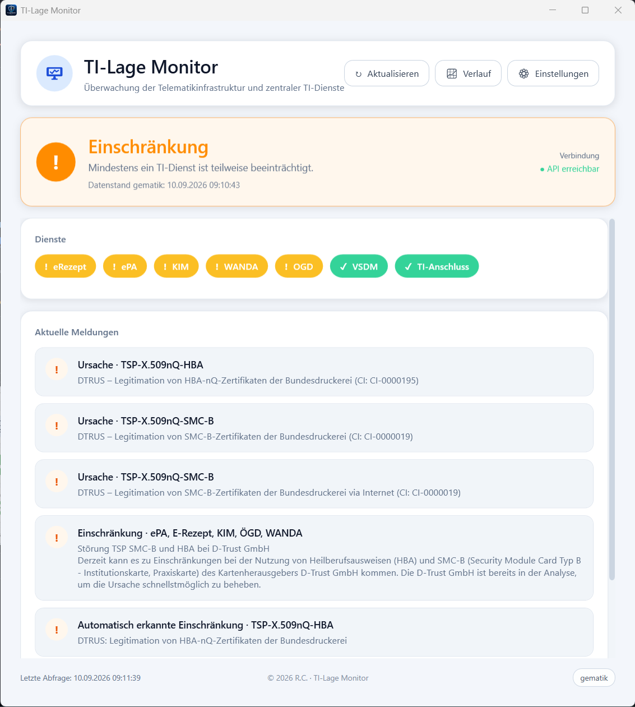
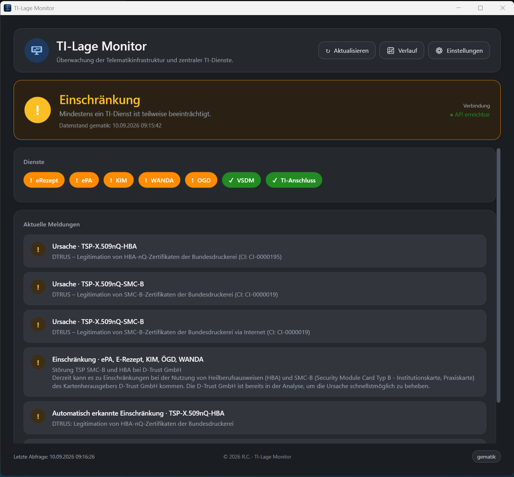

<p align="center">
  
</p>

<h1 align="center">TI-Lage Monitor</h1>

<p align="center">
  <strong>Der TI-Status der gematik direkt im Windows-Tray – inklusive 14-Tage-Ausfallhistorie.</strong><br>
  Schlank · lokal · ohne Login
</p>

<p align="center">
  <a href="https://github.com/jimmybonesde/TILageMonitor/releases/latest"></a>
  
  
  
</p>

<p align="center">
  <a href="https://github.com/jimmybonesde/TILageMonitor/releases/latest"><strong>⬇️ Neueste Version herunterladen</strong></a>
  ·
  <a href="#-in-60-sekunden-startklar">Schnellstart</a>
  ·
  <a href="#-funktionen">Funktionen</a>
  ·
  <a href="https://fachportal.gematik.de/ti-status#TI-Anschluss">gematik Fachportal</a>
</p>

> [!IMPORTANT]
> **Kein offizielles gematik-Produkt.** TI-Lage Monitor ist eine Community-App von Randy Carter (R.C.). Maßgeblich bleibt das [gematik Fachportal TI-Status](https://fachportal.gematik.de/ti-status#TI-Anschluss).

## 📸 Auf einen Blick

| Hellmodus | Dunkelmodus |
|:---:|:---:|
|  |  |

Die Hero-Karte fasst die Lage zusammen, Dienste erscheinen als Status-Pills, aktuelle Meldungen darunter. Das Tray-Icon zeigt den Zustand auch dann, wenn das Fenster geschlossen ist.

## 🚀 In 60 Sekunden startklar

1. [Neueste Version herunterladen](https://github.com/jimmybonesde/TILageMonitor/releases/latest).
2. **Empfohlen:** `TILageMonitor-x.y.z-Setup.exe` starten.
3. Installation abschließen — Startmenü-Eintrag und Desktop-Verknüpfung werden auf Wunsch erstellt.

> 💡 Der Setup-Installer ist vollständig offline und enthält .NET 10 sowie die Windows App SDK. Zusätzliche ZIP- oder Portable-Pakete werden nicht benötigt.

> [!WARNING]
> Die EXE ist derzeit **unsigniert**. Windows SmartScreen kann deshalb warnen. Details stehen in [SIGNING.md](SIGNING.md).

## ✨ Funktionen

| | Funktion | Was sie bringt |
| :--: | --- | --- |
| 🛡️ | **TI-Lage im Tray** | Schild mit grünem, amberfarbenem oder rotem Status-Badge |
| 🔎 | **Dienste im Blick** | eRezept, ePA, KIM, WANDA, OGD, VSDM und TI-Anschluss |
| 🔔 | **Windows-Benachrichtigungen** | Klickbare Toasts bei Störung, Teilausfall, API-Ausfall und Entwarnung |
| 🕒 | **14-Tage-Verlauf** | API-gestützte Ausfallhistorie mit Tages-Zoom; lokale Snapshots ergänzen die Verfügbarkeit |
| 🎨 | **Desktop-tauglich** | Fluent UI, Hell-/Dunkelmodus, Autostart und Einzelinstanz |
| ⚙️ | **Steuerbar** | Refresh, Fachportal-Link und Notify-Filter pro Dienst direkt aus der App |

### Statuslogik

| Status | Bedeutung |
| --- | --- |
| 🟢 **Grün** | Alle überwachten Dienste sind verfügbar |
| 🟠 **Amber** | Einschränkung oder Teilausfall |
| 🔴 **Rot** | Vollausfall oder kritische Störung |
| ⚪ **Keine Daten** | Öffentliche API nicht erreichbar oder noch kein Abruf erfolgt |

Die App ruft Lage, Incidents und Outages parallel ab und folgt dem gematik-Rhythmus mit Offset (`:01`, `:06`, `:11`, …). Nach drei aufeinanderfolgenden API-Fehlern zeigt sie einen dauerhaften „API down“-Status.

## 🖱️ Bedienung

| Aktion | Wirkung |
| --- | --- |
| Linksklick auf das Tray-Icon | Hauptfenster ein- oder ausblenden |
| **Aktualisieren** | Status sofort neu laden |
| **Verlauf** | 14-Tage-Historie mit API-Ausfällen öffnen |
| **Einstellungen** | Theme, Autostart und Benachrichtigungsfilter ändern |
| **gematik** | Fachportal im Browser öffnen |
| **Beenden** | Anwendung schließen |

## 📈 14-Tage-Verlauf

Der Verlauf kombiniert zwei Datenquellen:

- Die offizielle gematik-API liefert gemeldete Einschränkungen samt Statusschritten für die letzten **14 Tage** – auch wenn der PC ausgeschaltet war.
- Lokale, stündliche Snapshots ergänzen die Verfügbarkeitsanzeige, solange die App läuft.

Jeder Tag lässt sich anklicken und zeigt dann die Stundenansicht. Die Stundenleiste erscheint bewusst nur dort; die 14-Tage-Übersicht bleibt kompakt.

> Graue Felder bedeuten: Für diese Stunde liegt weder ein lokaler Snapshot noch eine gemeldete API-Einschränkung vor.

## 🧰 Installation für den Alltag

### Installer verwenden

Öffne PowerShell im heruntergeladenen Projektordner und führe aus:

```powershell
.\Install.ps1
.\Install.ps1 -DesktopShortcut -EnableAutostart
```

Die Installation legt die App unter `%LocalAppData%\TILageMonitor\` ab und erstellt einen Startmenü-Eintrag.

### Aus dem Quellcode bauen

Voraussetzungen: Windows 10/11 x64, [.NET 10 SDK](https://dotnet.microsoft.com/download/dotnet/10.0) und PowerShell 5.1+.

```powershell
git clone https://github.com/jimmybonesde/TILageMonitor.git
cd TILageMonitor
.\Build.ps1
.\Install.ps1
```

## 🔐 Daten & Datenschutz

- Nur öffentliche gematik-APIs — **kein Login, kein API-Key**
- Keine Cloud-Synchronisation
- Alle Dateien liegen lokal unter `%AppData%\TILageMonitor\`

| Datei | Inhalt |
| --- | --- |
| `settings.json` | Theme, Autostart, Notify-Filter |
| `last-lage.json` | Offline-Cache des letzten Stands |
| `history.json` | Stündliche lokale Ergänzung zum 14-Tage-Verlauf |

Verwendete Endpunkte:

- `https://ti-lage.prod.ccs.gematik.solutions/lageapi/v2/tilage`
- `https://ti-lage.prod.ccs.gematik.solutions/lageapi/v1/tistatus/incident`
- `https://ti-lage.prod.ccs.gematik.solutions/lageapi/v1/tistatus/outage`

## ⚠️ Bekannte Grenzen

- Nur für Windows x64
- Eine unsignierte EXE kann SmartScreen-Warnungen auslösen
- Ausfälle stammen bis zu 14 Tage aus der API; vollständige OK-Verfügbarkeit wird zusätzlich lokal erfasst
- Die App ergänzt das gematik Fachportal, ersetzt es aber nicht

## 🗂️ Für Entwickler

| Bereich | Zentrale Dateien |
| --- | --- |
| UI & Tray | `MainWindow.*`, `App.xaml(.cs)` |
| API & Modelle | `ApiClient.cs`, `Models.cs` |
| Persistenz | `SettingsStore.cs`, `CacheStore.cs`, `HistoryStore.cs` |
| Fenster | `SettingsWindow.*`, `HistoryWindow.*` |
| Systemdienste | `ToastService.cs`, `ToastRegistration.cs`, `ThemeService.cs`, `AutostartService.cs` |
| Build & Release | `Build.ps1`, `Install.ps1`, `.github/workflows/release.yml` |

Technik: WPF + WinForms-Tray · `net10.0-windows10.0.17763.0` · Windows App SDK App Notifications

## 👤 Autor

**Randy Carter** · R.C. · © 2026

<p align="center">
  <sub>Für Praxen & IT, die den TI-Status im Blick behalten wollen — ohne einen Portal-Tab offen zu lassen.</sub>
</p>
