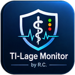

<p align="center">
  
</p>

<h1 align="center">TI-Lage Monitor</h1>

<p align="center">
  <strong>Windows-Tray-App für den aktuellen TI-Status der gematik</strong><br>
  Schlank · lokal · ohne Login
</p>

<p align="center">
  <a href="https://github.com/jimmybonesde/TILageMonitor/releases/latest"></a>
  
  
  
</p>

<p align="center">
  <a href="https://github.com/jimmybonesde/TILageMonitor/releases/download/v1.0.3/TILageMonitor.exe"><strong>⬇️ TILageMonitor.exe (v1.0.3)</strong></a>
  ·
  <a href="https://fachportal.gematik.de/ti-status#TI-Anschluss">gematik Fachportal</a>
</p>

> [!IMPORTANT]
> **Kein offizielles gematik-Produkt.** Community-App von Randy Carter (R.C.). Maßgeblich bleibt das [Fachportal TI-Status](https://fachportal.gematik.de/ti-status#TI-Anschluss).

---

## Überblick

TI-Lage Monitor hält den Zustand der Telematikinfrastruktur im Windows-Tray im Blick — mit Ampel-Icon, Toasts und einem lokalen 7-Tage-Verlauf.


## Features

### Status auf einen Blick
- Überwacht **eRezept, ePA, KIM, WANDA, OGD, VSDM, TI-Anschluss**
- Tray-Icon mit Ampel: **grün** (OK) · **amber** (Teilausfall/Beeinträchtigung) · **rot** (Vollausfall) · Wartung getrennt
- Tooltip mit Gesamtstatus · Linksklick blendet das Fenster ein/aus
- Refresh im gematik-Rhythmus mit Offset (`:01`, `:06`, `:11`, …)
- Parallele API-Abfragen (Lage + Incidents + Outages)
- Nach **3** API-Fehlern: dauerhafter „API down“-Zustand

### Benachrichtigungen
- Klickbare **Windows-Toasts** (Störung, Änderung, API down, „Alles wieder OK“)
- Balloon-Fallback, wenn Toasts nicht gehen
- Filter **pro Dienst** in den Einstellungen

### Darstellung & Desktop
- Fluent-UI, Hell-/Dunkelmodus, themige Ampel- und Scrollbalken-Farben
- Einstellungen-Fenster · Autostart mit `--tray` · Einzelinstanz
- Fachportal-Link direkt aus Tray/UI

### 7-Tage-Verlauf (lokal)
Die öffentlichen APIs liefern keine lange Zeitreihe — die App speichert stündliche Snapshots unter `%AppData%\TILageMonitor\history.json`.

- Heatmap **7×24**, Tages-Zoom, **Esc** zurück
- Wochentags-Köpfe (`Mo 09.09`), Stundenachse `0 / 6 / 12 / 18`
- Abdeckung z. B. `96 / 168 Stunden erfasst`
- Legende: OK · Einschränkung · Störung · **Wartung** · keine Daten
- Atomares Speichern von `history.json`

---

## Download & Installation

### Fertige EXE (empfohlen)

1. Neueste Version: [Releases](https://github.com/jimmybonesde/TILageMonitor/releases/latest)
2. `TILageMonitor.exe` speichern und starten  
   oder nach `%LocalAppData%\TILageMonitor\` legen (wie `Install.ps1`)

> [!WARNING]
> Build ist **unsigniert** — SmartScreen kann warnen („Weitere Informationen“ → trotzdem ausführen). Siehe [SIGNING.md](SIGNING.md).

### Aus dem Quellcode bauen

Voraussetzungen: Windows 10/11 x64, [.NET 8 SDK](https://dotnet.microsoft.com/download/dotnet/8.0), PowerShell 5.1+

```powershell
git clone https://github.com/jimmybonesde/TILageMonitor.git
cd TILageMonitor
.\Build.ps1
.\Install.ps1                    # optional
.\Install.ps1 -DesktopShortcut -EnableAutostart
```

Ergebnis: `publish\TILageMonitor.exe` → Installation nach `%LocalAppData%\TILageMonitor\`.

---

## Bedienung

| Aktion | Wirkung |
|--------|---------|
| Linksklick Tray | Fenster ein-/ausblenden |
| Jetzt aktualisieren | Sofortiger Refresh |
| gematik TI-Status | Fachportal im Browser |
| Einstellungen / Verlauf | Eigene Fenster |
| Autostart | Start mit Windows (`--tray`) |
| Beenden | App schließen |

---

## Daten & Datenschutz

- Nur öffentliche gematik-APIs — **kein** Login, **kein** API-Key
- Alles lokal unter `%AppData%\TILageMonitor\`

| Datei | Inhalt |
|-------|--------|
| `settings.json` | Theme, Autostart, Notify-Filter |
| `last-lage.json` | Offline-Cache letzter Stand |
| `history.json` | Stündlicher 7-Tage-Verlauf |

### API-Endpunkte

- `https://ti-lage.prod.ccs.gematik.solutions/lageapi/v2/tilage`
- `https://ti-lage.prod.ccs.gematik.solutions/lageapi/v1/tistatus/incident`
- `https://ti-lage.prod.ccs.gematik.solutions/lageapi/v1/tistatus/outage`

---

## Projektstruktur

| Bereich | Dateien |
|---------|---------|
| UI / Tray | `MainWindow.*`, `App.xaml(.cs)` |
| API | `ApiClient.cs`, `Models.cs` |
| Persistenz | `SettingsStore`, `CacheStore`, `HistoryStore` |
| Fenster | `SettingsWindow`, `HistoryWindow` |
| System | `ToastService`, `ThemeService`, `AutostartService` |
| Build | `Build.ps1`, `Install.ps1`, `.github/workflows/release.yml` |

Technik: WPF + WinForms-Tray, TFM `net8.0-windows10.0.17763.0`, `Microsoft.Toolkit.Uwp.Notifications`.

---

## Bekannte Grenzen

- Verlauf baut sich nur auf, **solange die App läuft** (kein Server-Backfill)
- Unsignierte EXE → mögliche SmartScreen-Warnung
- Nur Windows x64

---

## Autor

**Randy Carter** · R.C. · © 2026

---

<p align="center">
  <sub>Made for Praxen & IT, die den TI-Status im Blick behalten wollen — ohne Portal-Tab offen zu lassen.</sub>
</p>
